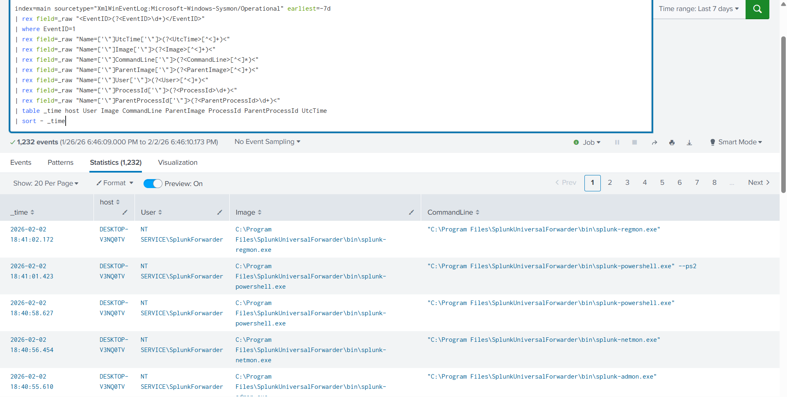
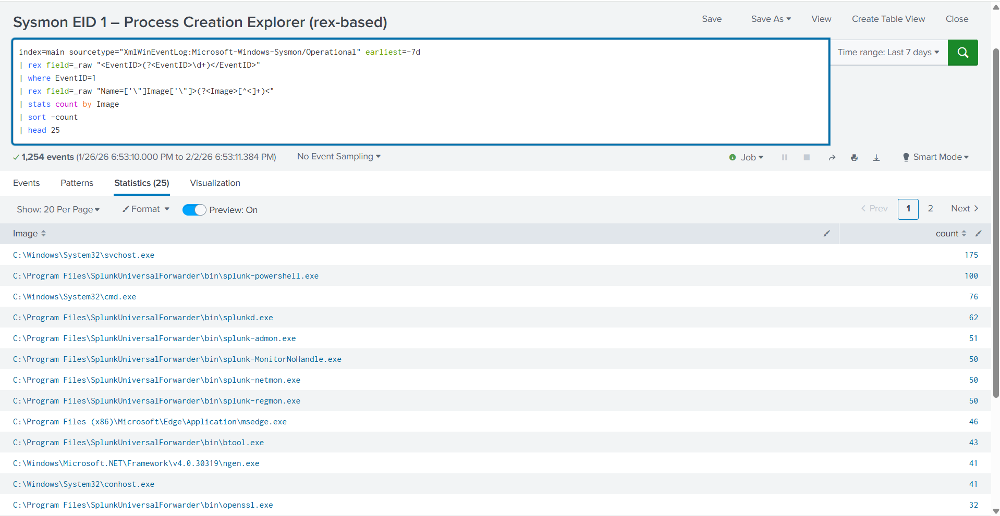
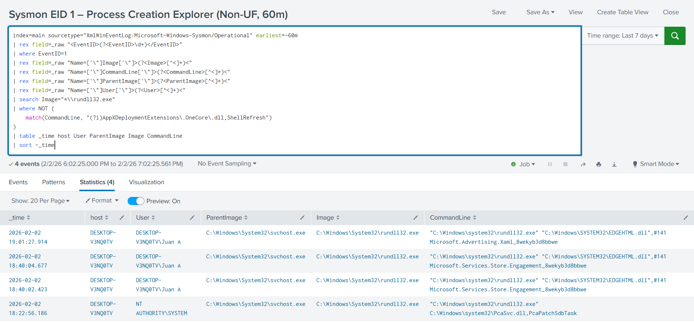
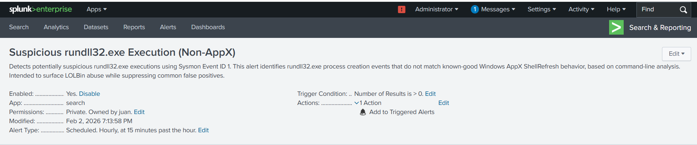

# Sysmon EID 1 Detection Engineering — Splunk

Detection engineering with Sysmon EID 1 in Splunk, including process baselining, LOLBin detections, and alert tuning.

---

## Overview

This repository documents a focused detection engineering experiment using **Sysmon Event ID 1 (Process Creation)** ingested into **Splunk**.

The goal was to establish trusted endpoint telemetry, build a process creation baseline, and engineer low-noise detections for common Windows LOLBins.

This experiment emphasizes **judgment, false-positive reduction, and alert operationalization**, rather than quantity of detections.

---

## Environment

- Windows 10 Endpoint
- Sysmon (Operational channel)
- Splunk Enterprise
- Splunk Universal Forwarder

Logs were ingested into Splunk and validated for consistency before detection development.

---

## Telemetry Validation

- Confirmed reliable ingestion of Sysmon Operational logs
- Identified inconsistent default field extraction
- Implemented **search-time XML parsing** using rex against raw event data
- Extracted key fields:
  - Image
  - CommandLine
  - ParentImage
  - User
  - ProcessId / ParentProcessId

This approach mirrors real-world scenarios where source parsing is imperfect.

#### Telemetry Validation — Sysmon Event ID 1 Visible in Splunk

---

## Baseline Analysis

- Built a noise-suppressed investigator view for process creation
- Excluded Splunk Universal Forwarder binaries to reduce agent noise
- Established a normal process execution baseline for the host

#### Baseline Extraction — Top Observed Processes

---

## Detections Implemented

### 1. Suspicious rundll32.exe Execution

- Focus: LOLBin abuse via signed binary proxy execution
- Technique: MITRE ATT&CK T1218.011
- Logic:
  - Detect rundll32.exe process creation events
  - Analyze full command-line context
  - Suppress known-good Windows AppX ShellRefresh behavior

#### Refined rundll32 Detection Logic

- Outcome:
  - Reduced false positives
  - Operationalized as a scheduled Splunk alert
  - Assigned **Low severity** due to benign-but-suspicious nature without corroboration

#### Alert Configuration — Non-AppX rundll32 Execution

---

### 2. Abnormal dllhost.exe Parent Process

- Focus: COM surrogate abuse detection
- Logic:
  - Detect dllhost.exe executions
  - Alert when spawned by unexpected parent processes
- Outcome:
  - Quiet baseline (0 results)
  - Implemented as a guardrail detection
  - Assigned **Low severity**

---

## Alerting Strategy

- Alerts are scheduled (not real-time)
- Trigger on any result (> 0)
- Throttled to reduce noise
- Severity intentionally scoped based on signal strength and context

This reflects SOC best practices for early-stage behavioral detections.

---

## Key Takeaways

- Reliable detections often require **search-time parsing**, not perfect sourcetypes
- LOLBins require **contextual analysis**, not binary name matching
- Low-severity alerts can still provide high investigative value
- Detection engineering is iterative and judgment-driven

---

## Scope (Out of Scope for This Repo)

This experiment focused exclusively on **Sysmon EID 1 process creation visibility**.

Future experiments intentionally excluded:

- Windows Security log authentication abuse
- Network correlation (Sysmon EID 3)
- Honeypot-based telemetry

---

## Author

Detection engineering lab developed as part of a Blue Team Home Lab project.
